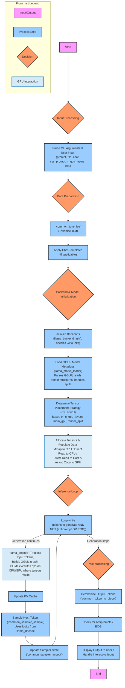

```mermaid
graph TD
    A["Start"] --> B{"Input Processing"};
    B --> B1["Parse CLI Arguments & User Input 
(prompt, file, chat, sys_prompt, n_gpu_layers, etc.)"];

    B1 --> C{"Data Preparation"};
    C --> C1["'common_tokenize' 
(Tokenize Text)"];
    C1 --> C2["Apply Chat Templates 
(if applicable)"];

    C2 --> D{"Backend & Model Initialization"};
    D --> D1["Initialize Backends 
(llama_backend_init(), specific GPU inits)"];
    D1 --> D2["Load GGUF Model Metadata 
(llama_model_loader)
Parses GGUF, reads tensor structures, handles splits"];
    D2 --> D3["Determine Tensor Placement Strategy 
(CPU/GPU)
Based on n_gpu_layers, main_gpu, tensor_split"];
    D3 --> D4["Allocate Tensors & Populate Data 
Mmap to CPU / Direct Read to CPU / 
Direct Read to Host & Async Copy to GPU"];

    D4 --> E{"Inference Loop"};
    E --> E1["Loop while 
(tokens to generate AND 
NOT (antiprompt OR EOG))"];
    
    E1 -- "Generation continues" --> E2["'llama_decode' (Process Input Tokens)
Builds GGML graph. 
GGML executes ops on CPU/GPU where tensors reside"];
    E2 --> E3["Update KV Cache"];
    E3 --> E4["Sample Next Token 
('common_sampler_sample')
Uses logits from 'llama_decode'"];
    E4 --> E5["Update Sampler State 
('common_sampler_accept')"];
    E5 --> E1;

    E1 -- "Generation stops" --> F{"Post-processing"};
    F --> F1["Detokenize Output Tokens 
('common_token_to_piece')"];
    F1 --> F2["Check for Antiprompts / EOG"];
    F2 --> F3["Display Output to User / 
Handle Interactive Input"];
    
    F3 --> G["End"];

    subgraph legend [Flowchart Legend]
        direction LR
        legend_input["Input/Output"]
        legend_process["Process Step"]
        legend_decision{"Decision"}
        legend_gpu_interaction["GPU Interaction"]
    end
    classDef input fill:#f9f,stroke:#333,stroke-width:2px;
    classDef process fill:#9cf,stroke:#333,stroke-width:2px;
    classDef decision fill:#f96,stroke:#333,stroke-width:2px;
    classDef gpu_interaction fill:#D6EAF8,stroke:#2E86C1,stroke-width:2px;
    
    class A,G input;
    class B1,C1,C2,D1,D2,D3,E1,E3,E4,E5,F1,F2,F3 process;
    class B,C,D,E,F decision;
    class D4,E2 gpu_interaction;
    
    class legend_input input;
    class legend_process process;
    class legend_decision decision;
    class legend_gpu_interaction gpu_interaction;
```
